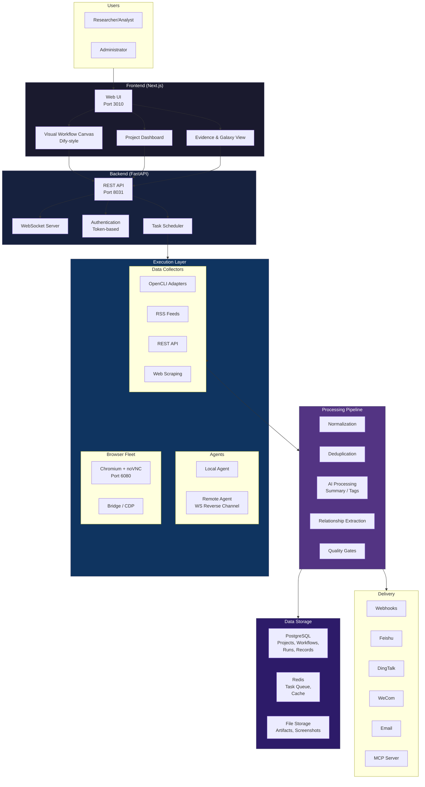
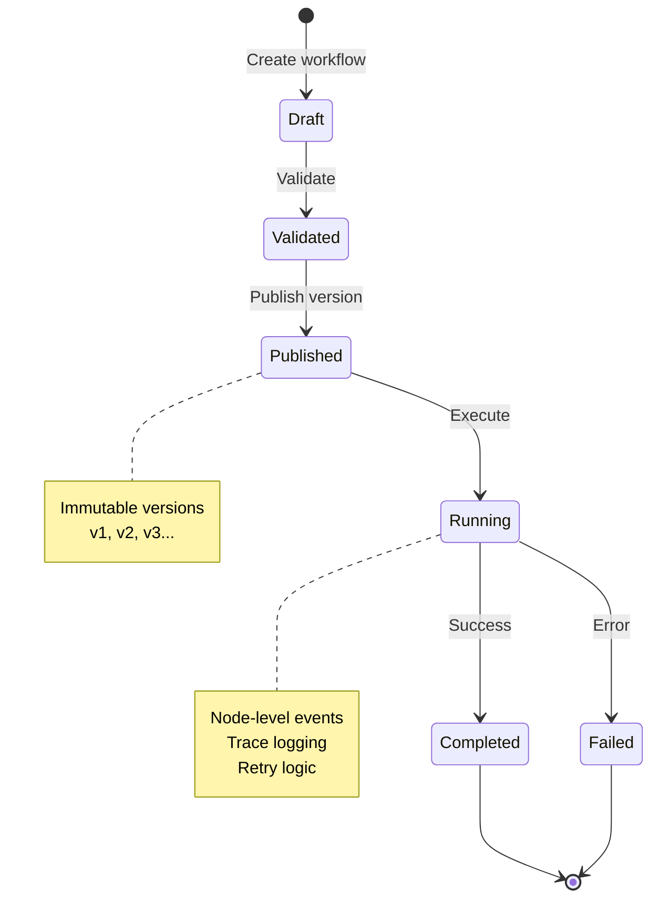
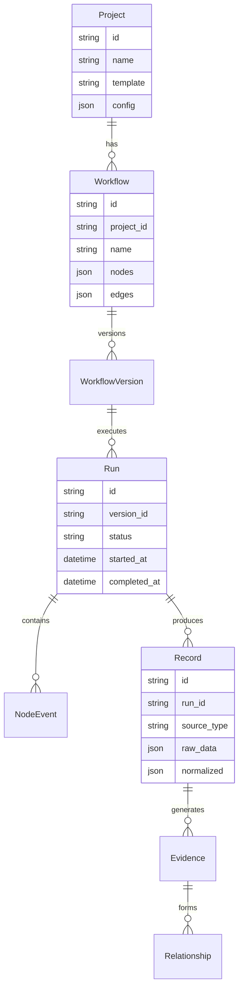
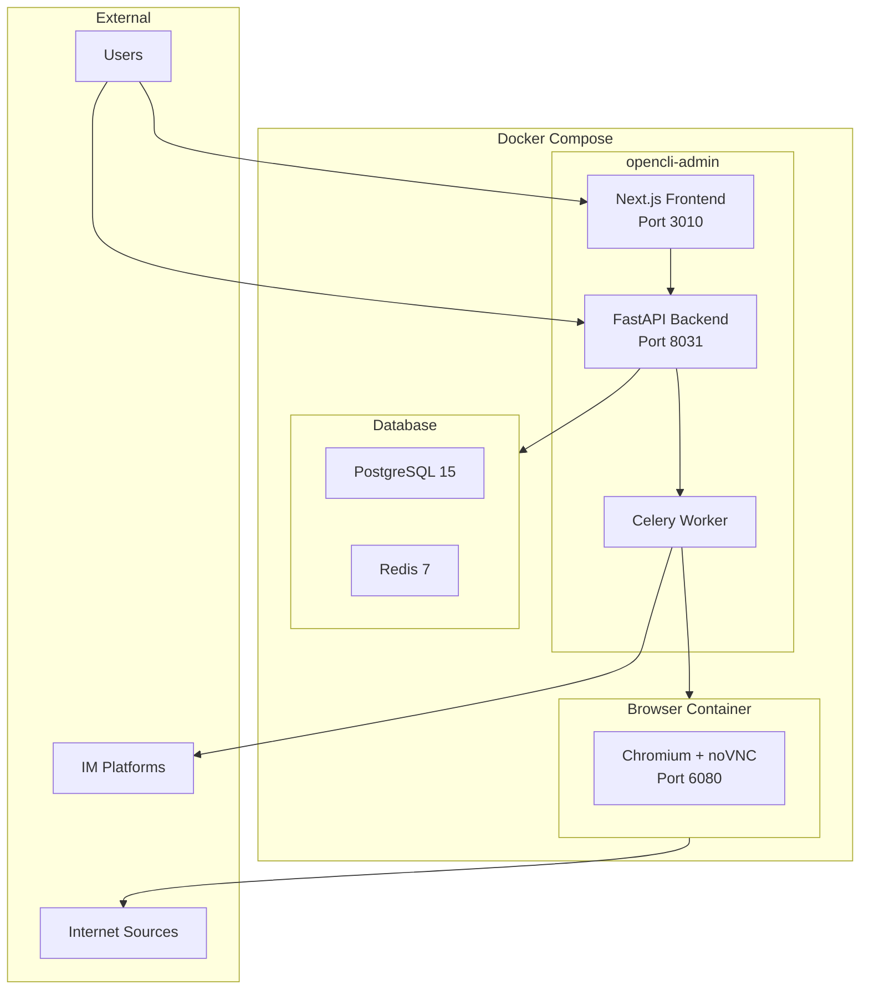

# OpenCLI Admin Architecture

## System Overview



## Core Components

### 1. Frontend (Next.js)

- **Visual Workflow Canvas**: Dify-style node-based workflow editor
- **Project Dashboard**: Project overview, run history, data browser
- **Evidence & Galaxy View**: Relationship visualization and exploration
- **Plugin Center**: Capability discovery and configuration

### 2. Backend (FastAPI)

- **REST API**: Full CRUD for projects, workflows, runs, records
- **WebSocket Server**: Real-time run events and trace streaming
- **Authentication**: Token-based auth (BOOTSTRAP_ADMIN_TOKEN, API_AUTH_TOKEN)
- **Scheduler**: Cron-like scheduled workflow execution

### 3. Execution Layer

- **Local Agent**: Built-in browser execution on host
- **Remote Agent**: Remote execution via WebSocket reverse channel
- **Browser Fleet**: Dockerized Chromium with noVNC for login-required sites
- **Bridge/CDP**: Chrome DevTools Protocol for browser control

### 4. Data Collectors

- **OpenCLI Adapters**: 229+ site-specific adapters
- **RSS Feeds**: Standard RSS/Atom feed collection
- **REST API**: Generic API polling
- **Web Scraping**: Custom scraping logic

### 5. Processing Pipeline

- **Normalization**: Standardize data formats across sources
- **Deduplication**: Content-based deduplication
- **AI Processing**: LLM-powered summarization and tagging
- **Relationship Extraction**: Entity and relationship identification
- **Quality Gates**: Configurable data quality rules

### 6. Delivery

- **Webhooks**: HTTP callbacks to external systems
- **IM Integrations**: Feishu, DingTalk, WeCom
- **Email**: SMTP delivery
- **MCP Server**: Model Context Protocol for AI agents

## Workflow Lifecycle



## Data Model



## Deployment Architecture



## Key Design Decisions

1. **Self-Hosted First**: All data stays on user's infrastructure
2. **Visual Workflows**: Non-technical users can build pipelines without code
3. **Immutable Versions**: Published workflow versions are immutable for reproducibility
4. **Evidence-Centric**: All collected data linked to evidence and relationships
5. **Dry-Run Default**: Safe execution with explicit publish step
6. **Multi-Architecture**: Docker images for amd64 and arm64

## Technology Stack

- **Frontend**: Next.js 14, React, TypeScript
- **Backend**: FastAPI, Python 3.11+
- **Database**: PostgreSQL 15, Redis 7
- **Task Queue**: Celery
- **Browser**: Chromium, noVNC, Playwright
- **Container**: Docker, Docker Compose
- **AI Processing**: OpenAI-compatible API (configurable)

## File Structure

```
opencli-admin/
├── frontend/               # Next.js frontend
│   ├── src/
│   │   ├── app/           # App router pages
│   │   ├── components/    # React components
│   │   └── lib/           # Utilities
│   └── package.json
├── backend/                # FastAPI backend
│   ├── app/
│   │   ├── api/           # API routes
│   │   ├── core/          # Core logic
│   │   ├── models/        # Database models
│   │   └── services/      # Business logic
│   └── requirements.txt
├── workers/                # Celery workers
├── scripts/                # Installation scripts
├── docker-compose.yml      # Container orchestration
├── Dockerfile              # Container definition
└── docs/                   # Documentation
```
