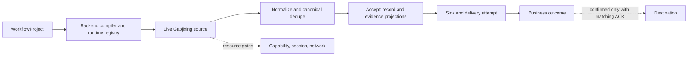
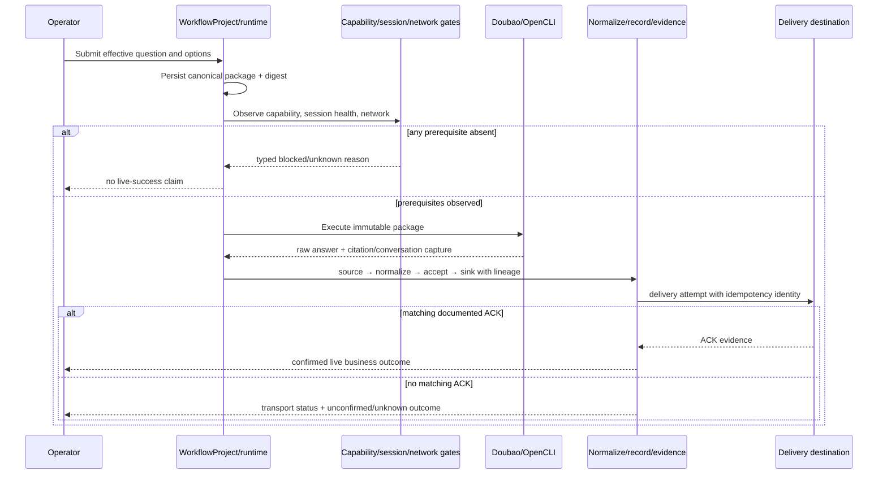

# Architecture Spine — Gaojixing Live Business Chain

## Design Paradigm

A compiled `WorkflowProject` graph owns orchestration; an evidence-bearing source-to-sink pipeline owns the business chain. The Gaojixing source is a live-mode Doubao adapter behind the existing runtime boundary, then crosses `source → normalize → accept → sink`; it does not introduce a parallel executor or data path. This ratifies the runtime PRD’s Canvas/compiler/III/OpenCLI/ODP reuse decision and the backend-authoritative graph ADR. [Runtime PRD](../../../../docs/workflow-hda-demand-runtime-PRD.md#L72-L91) [ADR-0009](../../../../docs/adr/0009-plan-ir-free-graph-two-tier-attribution.md#L20-L29)

## Invariants & Rules

### AD-1 — One compiled workflow path [ADOPTED]

- **Binds:** all Gaojixing execution, runtime bindings, and projections.
- **Prevents:** a Gaojixing-specific executor, backend rewrite, or browser-side result-producing preview.
- **Rule:** Author the run as a `WorkflowProject`; compile it through the existing runtime registry and route the live Doubao source through the existing OpenCLI/III/ODP-compatible chain. Use Canvas/Plan health for downstream stages while preserving source-keyed attribution at the source boundary. [Runtime PRD](../../../../docs/workflow-hda-demand-runtime-PRD.md#L74-L91) [ADR-0009](../../../../docs/adr/0009-plan-ir-free-graph-two-tier-attribution.md#L11-L24)

### AD-2 — Immutable package and complete lineage [ADOPTED]

- **Binds:** question package, raw answer, citations, conversation projection, normalized record, evidence, replay, delivery, and audit views.
- **Prevents:** mutable source settings replacing the effective question, cross-run evidence attachment, and dedupe that loses traceability.
- **Rule:** Persist the canonical effective question package and digest before dispatch. Every artifact and projection carries the package digest and originating run/execution plus established project, source/binding, worker/runtime, and artifact references. A mismatch is rejected or quarantined; a raw response is not a record or a deliverable business item. [OpenSpec spec](../../../../openspec/changes/gaojixing-live-business-chain/specs/gaojixing-live-business-chain/spec.md#L21-L32) [OpenSpec spec](../../../../openspec/changes/gaojixing-live-business-chain/specs/gaojixing-live-business-chain/spec.md#L47-L58) [OpenSpec spec](../../../../openspec/changes/gaojixing-live-business-chain/specs/gaojixing-live-business-chain/spec.md#L86-L97)

### AD-3 — Independent evidence and outcome states [ADOPTED]

- **Binds:** capture and delivery projections.
- **Prevents:** URL extraction posing as verified citation, unknown conversation identity becoming a guessed URL, and HTTP `202`/accepted transport becoming business success.
- **Rule:** Persist answer, citation, and conversation as separate evidence projections with capture status and provenance. Persist transport and business outcome separately. Only a documented destination ACK/equivalent that matches the delivery attempt and lineage may set business outcome to `confirmed`; otherwise retain `unconfirmed`, `unknown`, `partial`, `blocked`, or `failed` as applicable. [OpenSpec spec](../../../../openspec/changes/gaojixing-live-business-chain/specs/gaojixing-live-business-chain/spec.md#L34-L45) [OpenSpec spec](../../../../openspec/changes/gaojixing-live-business-chain/specs/gaojixing-live-business-chain/spec.md#L60-L71) [ADR-0021](../../../../docs/adr/0021-delivery-separates-submission-from-business-outcome.md#L3-L13)

### AD-4 — Live gates never fall back [ADOPTED]

- **Binds:** capability readiness, session, network, fixture/mock mode, and acceptance reporting.
- **Prevents:** a configured catalog entry posing as readiness, fixture/mock evidence satisfying live gates, or a missing dependency becoming a simulated success.
- **Rule:** Live execution requires observed published executable live capability, authenticated healthy persistent Doubao session, permitted network, valid answer/evidence/lineage, and matching destination ACK. Fixture/mock output must expose non-live mode and provenance and is excluded from live acceptance. Any missing or contradictory prerequisite ends in an explicit typed blocked/unknown/failed state, never implicit fallback. [OpenSpec spec](../../../../openspec/changes/gaojixing-live-business-chain/specs/gaojixing-live-business-chain/spec.md#L7-L19) [OpenSpec spec](../../../../openspec/changes/gaojixing-live-business-chain/specs/gaojixing-live-business-chain/spec.md#L73-L110)

## Consistency Conventions

| Concern | Convention |
| --- | --- |
| IDs and lineage | Package digest, run/execution, project, source/binding, worker/runtime, artifact, and delivery-attempt identity are retained across every projection. |
| Evidence | Answer, citation, and conversation are separate; citation extraction remains unverified unless an independent verifier records otherwise; unavailable values remain `unknown`/`null`. |
| State | Readiness, transport, and business outcome never collapse to one status. A blocked prerequisite has its precise reason; business confirmation requires ACK evidence. |
| Fixtures | Every test/preview artifact carries `fixture`/`mock` mode plus provenance and cannot feed live-acceptance reporting. |

## Structural Seed

## Capability → Architecture Map

| Capability / area | Lives in | Governed by |
| --- | --- | --- |
| Readiness and live capture | Existing Gaojixing/Doubao runtime and session-bound OpenCLI channel | AD-1, AD-4 |
| Package identity | Canonical question snapshot/digest before dispatch | AD-2 |
| Evidence and lineage | Answer/citation/conversation capture; normalize, record, evidence, replay projections | AD-2, AD-3 |
| Delivery and acceptance | Idempotent delivery attempt plus destination ACK evidence | AD-3, AD-4 |
| Runtime evidence | Run events, SSE parity, runtime contracts, and ODP/Redis mirror where configured | AD-1; [Runtime conformance](../../../../docs/workflow-runtime-conformance.md#L10-L29) |

## Deferred

- Do not choose a new provider, credential mechanism, destination protocol, quota model, or citation-verification service here; the OpenSpec explicitly excludes inferring those facts. [OpenSpec proposal](../../../../openspec/changes/gaojixing-live-business-chain/proposal.md#L48-L53)
- Do not claim current live acceptance from repository tests, historical fixtures, HTTP `202`, or the operator-reported seven-running/Doubao-session/Chrome-pool/ODP-`NOGROUP` snapshot. These require a fresh run-scoped evidence receipt against the matrix companion. [OpenSpec proposal](../../../../openspec/changes/gaojixing-live-business-chain/proposal.md#L36-L46)
