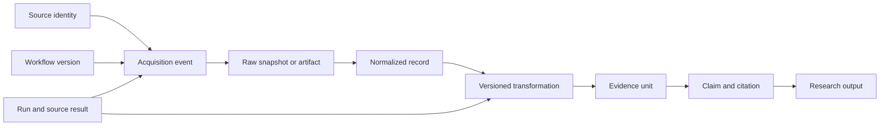

# Source Chain Contract

CAP-3 is the governing contract. Exact storage schemas are architecture decisions, but every implementation must preserve the following semantic chain.

## Required identities

| Object | Required stable context |
|---|---|
| Source | Source ID, source type, locator or account scope, adapter capability and version |
| Acquisition | Project ID, workflow version, run ID, source result, acquisition time, status, error classification |
| Raw material | Content hash, immutable artifact or snapshot reference, media type, capture metadata |
| Transformation | Operator identity and version, inputs, outputs, parameters or configuration reference |
| Evidence unit | Stable ID, normalized content, links to raw material and transformation history |
| Claim or citation | Stable ID, supported text or structured assertion, supporting evidence IDs, confidence or conflict state |
| Research output | Stable ID and revision, originating objective and plan, included claims, gaps, conflicts, creation time |

## Invariants

- No transformation, cleaning, merge, or export may erase upstream identity.
- Merge combines source results and lineage explicitly; it does not silently clean or deduplicate.
- Deduplication records equivalence without deleting the ability to inspect each acquisition occurrence.
- Partial success remains partial: successful evidence is usable, while absent or failed sources remain visible in completeness metadata.
- A claim with no traversable supporting evidence is draft or unsupported, never authoritative.
- Reacquisition creates a new temporal observation; it does not rewrite the evidence used by an older published research output.
- Workflow and capability versions used by a run are immutable references.
- Secrets, session cookies, and sensitive authentication data never enter lineage, trace, citation, or exported research payloads.

## Minimum conformance demonstration

Run one persistent project against at least three heterogeneous live sources with one intentional source failure. Produce a research output containing a supported claim, a conflicting claim, and an unresolved gap. Through the public MCP or HTTP surface, traverse the supported claim to its evidence, normalized record, raw artifact, acquisition event, failed sibling source result, run, and workflow version. Repeat acquisition after a source changes and prove that both observations and the older output remain reconstructable.

