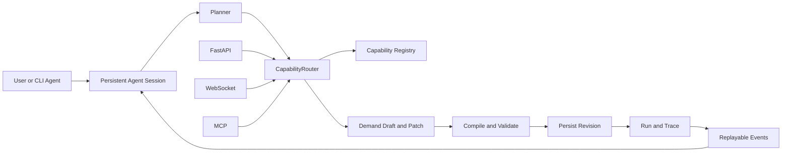

# Expose Capabilities Through an API-First Agent Loop

OpenCLI Admin will expose registered capabilities once through a single command interface. REST, MCP, WebSocket, and the in-product Agent are adapters at that seam; they must not reimplement workflow authoring or execution logic.

## Context

The backend already owns workflow capability discovery, demand drafting, patching, compilation, persistence, execution, and event streaming. The global Agent currently exposes a separate hand-written tool list and cannot create or revise a Workflow Draft. Adding another endpoint or Agent tool for every node duplicates contracts and makes composition slower than node development.

The product needs a persistent, high-frequency loop in which a user describes intent, the Agent composes existing nodes, the backend validates the change, and run events return to the same session.

## Decision

Introduce one deep module, `CapabilityRouter`, with one command interface:

```text
handle(CommandEnvelope) -> CommandResult
```

`CommandEnvelope` contains:

- `sessionId`, `requestId`, and monotonic `sequence`;
- workspace, project, and workflow scope;
- `capabilityId` plus a version pin;
- one operation and validated input;
- the expected Workflow Draft revision for writes.

`CommandResult` contains:

- an acknowledgement for the request and sequence;
- typed output or a stable error;
- the resulting revision when state changes;
- zero or more replayable events;
- an optional confirmation proposal for governed writes.

The capability registry remains the source of truth. A registered capability provides its identifier, version, input/output schemas, read/write risk, runtime availability, and handler. Transport adapters derive discovery and invocation surfaces from that registry:

- FastAPI adapter for request/response and SSE replay;
- WebSocket adapter for persistent high-frequency sessions;
- MCP adapter for external Agents and CLI clients;
- in-product Agent adapter for natural-language planning and tool selection.

Workflow composition uses the existing demand-draft, patch, compile, persistence, run, and trace implementations behind the router. The Agent emits incremental operations rather than replacing a complete graph on every turn.



## Routing Loop

1. Accept a user turn on a persistent session.
2. Resolve real capabilities from the registry.
3. Produce the smallest Workflow Patch that satisfies the turn.
4. Apply it against the expected draft revision.
5. Compile and return concrete gaps to the Agent.
6. Repeat planning only for unresolved gaps.
7. Persist the accepted revision.
8. Run on request and stream node events and Trace back into the session.

Every request is idempotent by `requestId`. Sequence gaps trigger replay instead of silent reordering. Writes use optimistic revision guards and the existing confirmation path. Slow runs do not block the command loop; they return a run handle and publish events with bounded buffering.

## Consequences

- A node or tool is registered once and becomes discoverable through every transport.
- The global Agent can compose existing nodes without owning another workflow implementation.
- Existing FastAPI routes can migrate behind the router incrementally; a repository-wide endpoint rewrite is not required.
- Transport behavior, authentication, confirmation, idempotency, revisions, and backpressure become part of the command interface and its contract tests.
- Direct CRUD routes may remain for human administration, but Agent and automation clients use capability commands for composition and execution.

## First Slice

The first vertical slice exposes five commands through FastAPI, WebSocket, MCP, and the global Agent:

1. `workflow.capabilities.list`
2. `workflow.draft.from_demand`
3. `workflow.draft.patch`
4. `workflow.draft.compile`
5. `workflow.run.start`

Completion requires one session to accept multiple turns, preserve draft revision state, create a runnable pipeline from registered nodes, and stream its run events without page refresh.
