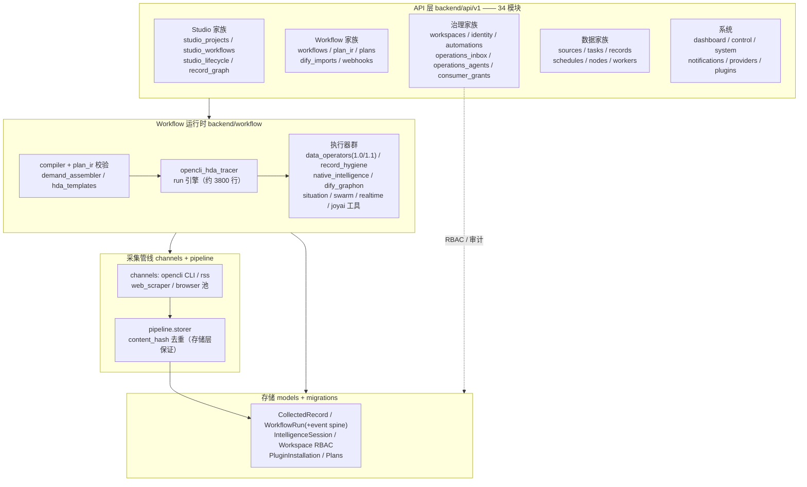
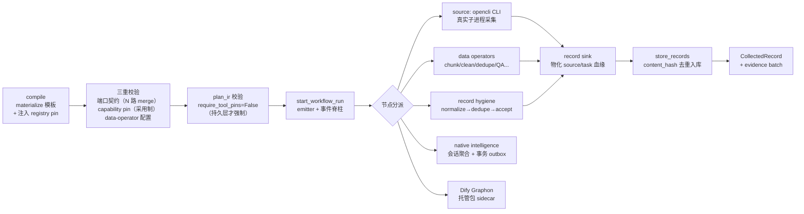

# opencli-admin 后端架构声明（分支归一后）

> 基线：main `b65708b`（2026-07-26）。三条产品线——安全加固线（`fix/sec-correctness-hardening`）、运营治理线（`notification-ack-cleanup-work`）、unified 产品线（`codex/unified-product-3002`）——已全部并入 main；迁移头归一为 `1901f6da7138`；八处跨线接缝已缝合（见 [#43](https://github.com/2233admin/opencli-admin/issues/43)）。
>
> 本文是给协作 Agent / 新会话的**架构声明**：动 `backend/` 前先读这份。`docs/ARCHITECTURE.md` 为合并前的旧全量文档, 与本文冲突处以本文为准。

| 指标 | 值 |
|---|---|
| v1 API 路由模块 | 34 |
| OpenAPI operations（治理台账对账后） | 194（台账：`docs/backend-capability-exposure-matrix.yaml`） |
| 测试 | unit+compat+integration ≈ 2374 通过, 0 xfail |
| Alembic | 单头 `1901f6da7138` |

## 1. 分层总图

**路由注册规则**：`backend/api/v1/__init__.py` 按序 include, 同路径**先注册者胜**（starlette 语义）。Studio 家族先注册——归一时据此摘除了整个被遮蔽的 `workflow_assets` 死路由面。新增路由前先确认路径无撞。

## 2. Workflow 运行主线

关键不变量：

- **事件脊柱 append-only**：`workflow_run_events` 用 per-run 序列分配器 + canonical payload 比对做幂等；重放与续传全靠它。事件一旦持久化, 后续以 DB 台账为准。
- **续传（continuation）在 per-run 锁内 session-first 读 DB**：内存镜像 `_RUNS` 只在 `queue_after_commit` 回调后刷新, run 中途 commit 会让它停在过期快照——不可作为续传数据源（#43 案例 6-8）。
- **验收门（record-acceptance）要求 unique-dedupe 凭证**：hygiene 版 dedupe 与 data-operator 版去重算子都在执行器出口盖 `dedupe:{status:"unique"}` 章, 两线互认（#43 案例 1-2）。
- **capability pin 分层**：compile/run 缺 pin 时采用 registry 当前版本, 只有显式 mismatch 报错；**Plan 持久化仍强制显式 pin**（`require_pin` / `require_tool_pins` 参数）。导入的 unknown 外部工具在预览里保留为 Capability Gap 软标记, 持久化仍拒（#43 案例 3、5）。
- **merge 节点动态扇入**：demand assembler 按 catalog 匹配可产生 3+ 源；compiler 接受 `in<N>` 端口且 plan 端口按实际边生长。多源排序以**需求文本首次提及位置**为第二键, 不依赖 catalog 顺序（#43 案例 4）。

## 3. 两条产品线的融合点

合并的本质是两套 workflow 运行时叠进同一个 tracer。四个接缝的裁决：

| 接缝 | main 数据线 | unified 智能线 | 融合裁决 |
|---|---|---|---|
| 去重凭证 | `workflow.data.*` 算子 | `record_hygiene` dedupe | 执行器出口统一盖章, 验收门互认 |
| 版本 pin | compile 即拒未 pin | 物化工具无 pin | 分层：compile/run 采用制, 持久化强制显式 pin |
| merge 扇入 | catalog 匹配 N 源 | 静态 in1/in2 契约 | compiler 动态 `in<N>` + plan 端口按边生长 |
| 续传读源 | per-run 锁（并发修复） | session 优先读库 | 两者叠加：锁内 DB-first |

## 4. 治理面（notification-ack 线）

- **Workspace RBAC**：`workspaces.py`（成员/角色）+ `identity.py`（User / Team / ServiceIdentity）。**已知 TODO**：RBAC 版工作区列表被 Studio 全量版 `GET /workspaces` 遮蔽——dev 模式（无 OIDC）依赖全量版；接 OIDC 前必须切换。
- **Operations 控制面**：`operations_inbox`（工作项）、`operations_agents`（版本化 Agent 身份 + 权限画像）、`automations`、`consumer_grants`。
- **暴露台账**：`docs/backend-capability-exposure-matrix.yaml` 锁 194 个 operations, `test_capability_exposure_matrix` 盯漂移。合并新增的 workspace-governance 条目标注 "governance review pending", 待复核。
- **通知**：`NotificationSendResult` 契约（含 ack 字段）+ 三阶段派发（计划 / 发送 / 短会话回写）；webhook 出站走 SSRF guard, 网络异常收敛为 `WorkflowWebhookDeliveryError`。

## 5. 存储与迁移

- SQLite（dev, `aiosqlite`）/ PostgreSQL（compose）。迁移单头 `1901f6da7138`——运营线（workspace RBAC / operations / versioning）与产品线（plugin / feed / intelligence session）双链在此汇合。
- **Legacy 升级路径已验证**：旧 plugin-hub 链 rejoin 拓扑下, 版本化迁移对缺失的 `workflow_runs` 表容忍跳过（online inspector guard；offline SQL 渲染不受影响）。模式参照 spine 迁移的缺表 early-return 惯例。
- **去重是存储层保证**：`store_records` 按 `(source, content_hash)` 拦截。实测：A 股采集两轮 125→126, 仅真实新增入库。

## 6. 已知债务

1. **webhook 顺序耦合 flake**——`test_webhook_trigger_success/empty_body` 仅在 unit+integration 混跑顺序下偶发, 单独稳绿。测试隔离债, 非产品 bug。
2. **RBAC 工作区列表切换**——见第 4 节, OIDC 上线前处理。
3. **台账治理复核**——约 30 条 operations 带 "governance review pending"。
4. **前端归 5080 机器**——本机不改 `frontend/`；unified 信息架构已在 main。

## 附：归档索引

被清理分支的 tip 全部保存在 `archive/*` tags（12 个, 已推 GitHub）。恢复：`git checkout -b <name> archive/<name>`。
